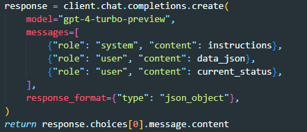

1. `make_decision_and_execute` - main
   - 2,3 을 통해 나온 GPT 의 응답을 load
   - `buy` - `execute_buy`
   - `sell` - `execute_sell`
2. `fetch_and_prepare_data`
   - 일봉 30일 + 60분봉 24시간
   - 위 봉에 대한 보조지표 추가
   - json 형태로 변환
3. `analyze_data_with_gpt4`

   - `get_current_status` method - 투자에 대한 정보를 불러와 json 형태로 반환
   - 2에서 반환된 결과
   - prompt(json 데이터 + instructions)를 통해 GPT API 요청
   - response format 을 json object 로 설정 - json 으로만 응답이 오도록.

   - 
