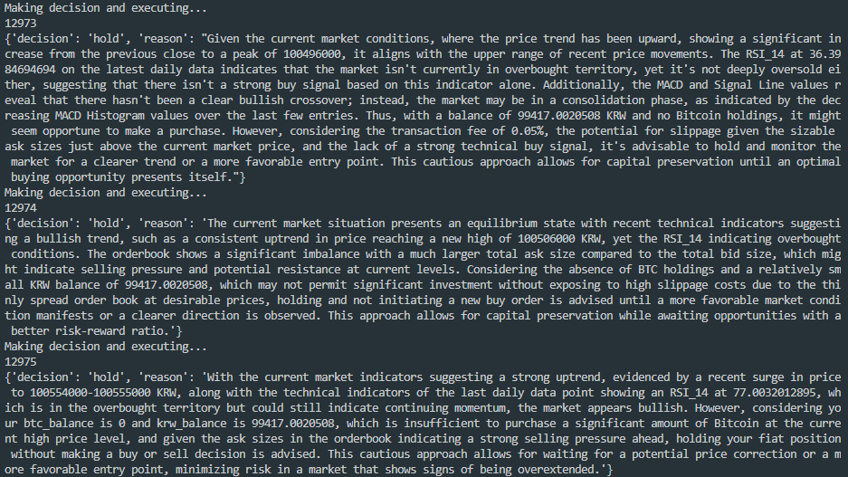

# IDEA
> [코인 자동매매 프로그램](https://github.com/MangooH/Coin_trade_program-with_tkinter)을 제작하면서,
> 해당 프로그램은 RSI 보조지표 하나를 가지고 구현이 되었지만, 실제로 협업한 트레이더의 매매 기법은 상당히 복잡하다.
> 이를 알고리즘 상에 일일이 담아내고, 테스트하는 것이 상당히 오래걸릴 것이다.
> 따라서, 매매기법을 prompt engineering 으로 풀어 LLM이 매매를 판단하게 하는 프로그램을 만들어봐야겠다고 생각했다.

# Prompt engineering 의 적용

> - [프롬프팅 26가지 원칙](https://enjoy-zero-to-one.tistory.com/58)을 기반으로 prompt engineering 을 연습한다.
> - Prompt 를 통해 비트코인 매매 전략을 수립하여 Open AI API을 요청하여 매매 여부에 대한 응답을 얻는 프로젝트

## IDEA

- `정성 데이터를 자유롭게 넣을 수 있다`
  - 투자 성향
  - 연준 발언
  - 대가들의 트윗 / 인터뷰
- `정량데이터 역시 추가가능하다`
  - 일봉(30개), 60분봉(24개)
  - 보조지표 6개

## Result



## 기본 환경

### Language

- 영어를 사용하는 것이 가장 좋음

### Markdown

- Prompt 는 Markdown 문법이 권장됨.
- 실제 ChatGPT의 응답은 markdown 형태로 자주 나옴.

### 특별한 설명이 없는 단락

- task 에 대해서 필요한 정보
- **_동일한 언어 사용_** - 26번째 원칙: 그 정보에 대한 자세한 설명이다(강조)

## Role

- **_역할부여_** - 16 번째 원칙
  ```
  You serve as the KRW-BTC Bitcoin Investment Analysis Engine
  ```
- **_'해야함'을 명시_** - 9 번째 원칙
  ```
  tasked with issuing hourly investment recommendations for the KRW-BTC (Korean Won to Bitcoin) trading pair
  ```
- 투자 전략 설정 (원칙x - custom) 끼워 맞추자면 **_'해야함'을 명시_** - `objective`
  ```
  Your objective is to maximize returns through aggressive yet informed trading strategies.
  ```

## JSON Data

- **_one-shot prompting(예시 제공)_** - 7 번째 원칙
- tabular 데이터를 json 형식으로 바꾸며, 이에 대해서 예시를들어 설명함

### JSON Data 1

- `fetch_and_prepare_data` method 에 대한 해석을 적어줌.
- 30일간의 일봉
- 24시간의 60분봉
- 위 tabular 데이터를 사용하여 `add_indicators` method 를 통해 보조지표 추가

  > 기술적 분석에 유용한 pandans_ta library 사용

  - Moving Averages
  - RSI
  - Stochastic Oscillator
  - MACD
  - Bollinger Bands

- (LLM에서 tabular 데이터를 읽지 못함) -> 해당 tabular 데이터를 json 형식으로 바꿈
- json 에 담긴 정보의 예시를 prompt 에 담아줌.

### JSON Data 1

- 매매에 필요한 정보
- `get_current_status` mehtod 에 대한 해석

### Instruction Workflow

- **_세분화 (CoT, Chain-of-thoght)_**

### Considerations

```
This task significantly impacts personal assets, requiring careful and strategic analysis.
```

- **_"단계별 생각", step by step_**

```
Take a deep breath and work on this step by step.
```

# Example - Few shot Prompt + CoT

- ChatGPT 를 사용해서 만든 Buy, Sell, Hold 전략 예시

